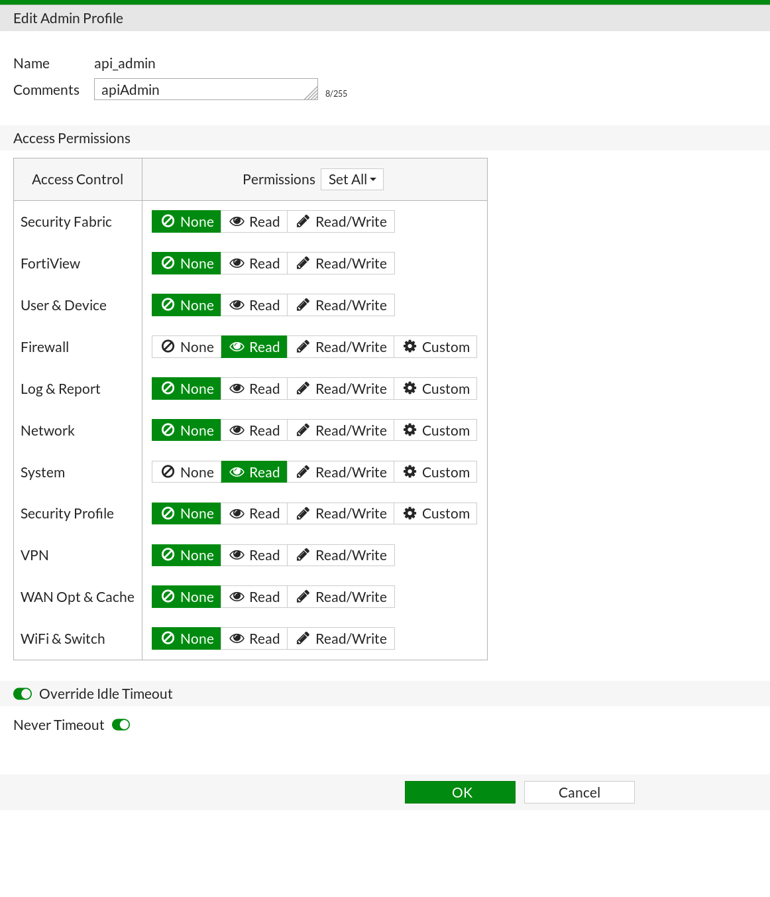
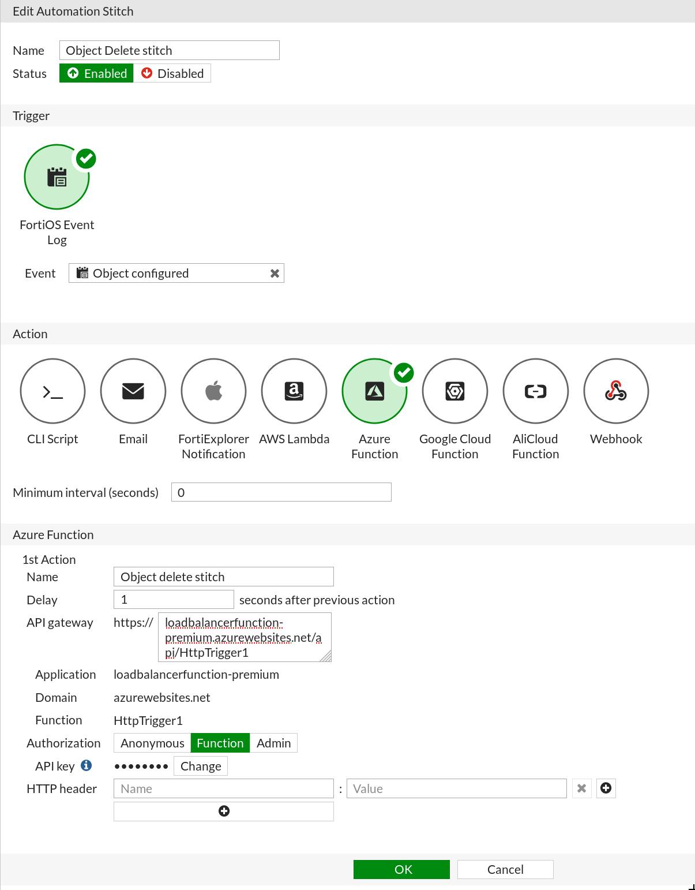
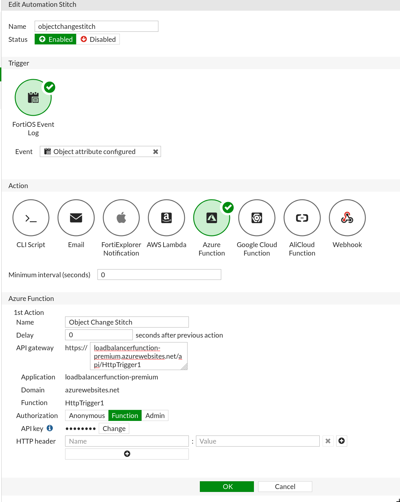

# Introduction

ForitGate `load-balancer-rule-sync` allows you to automatically sync TCP and UDP VIP rules created on your FortiGate to an external load balancer on Azure.

The script will create load balancing rules on an Azure Load Balancer by syncing the frontend ports of any FortiGate VIP as the front and backend ports for the load balancing rules.

> **Note:** Any existing load balancing rules will be overwritten.

## Requirements

- A FortiGate with:
  - Logging enabled.
  - Port forwarding enabled.
  - An API token. For details on generating the API token, refer to the section **The API key**.
- An external Load Balancer has been set up.
- A service principal. When creating the [service principal](https://docs.microsoft.com/en-us/azure/active-directory/develop/howto-create-service-principal-portal), make note of the Application ID (used in **Application Settings** for the REST_APP_ID) and the Application secret (used in **Application Settings** for the REST_APP_SECRET). The application secret only appears once and cannot be retrieved.


## Restrictions

- FortiGate VIPs supports the SCTP and ICMP protocols. These protocols are not currently supported in the load balancing rules of an Azure Load Balancer and will be dropped with the following error messages:
  ```
  ICMP is not supported in Azure Load Balancers. Pick UDP or TCP in the VIP.
  SCTP is not supported in Azure Load Balancers. Pick UDP or TCP in the VIP.
  ```
- Port ranges are supported on the FortiGate but not on the Azure Load Balancer. These will appear as separate ports on the Azure Load Balancer with a dash and a number appended to the end of the name.
- Azure Load Balancers have a limit of 300 ports. As such, large port segments will not be able to sync.
- Overlapping ranges are allowed in the FortiGate as long as the source IP ranges are different. This feature is not present on the Azure Load Balancer. Any port ranges that overlap a previous range will be dropped.
- Stitches will not be triggered by a purge command in the CLI.

# Set up

1. Set up a **premium function app** service account.
2. For **OS**, click on **Windows**.
3. Under **Runtime Stack**, select **nodejs**.
4. Copy the code from `./dist/index.js` into the function.
5. Install the required modules by running `npm install`.<br>
   The following are required:
      * @azure/ms-rest-js
      * @azure/ms-rest-nodeauth
      * @azure/arm-network
      * axios
6. Select the function app and click **Application settings**.
7. Under **Application settings** add the following key value pairs:
   | Key | Value |
   | --- | ----- |
   | REST_APP_ID | Client or Application ID. |
   | REST_APP_SECRET | Password or Secret. |
   | SUBSCRIPTION_ID | Your Subscription ID. |
   | TENANT_ID | Domain or Tenant ID. |
   | RESOURCE_GROUP_NAME | The Resource Group in which the VMs are located. |
   | LOADBALANCER_NAME | The external Load Balancer name. |
   | FORTIGATE_IP | The IP address of your master FortiGate. |
   | API_KEY | The API key generated on your FortiGate.<br>For details on how to generate the API key, refer to the section **The API key**. |
   | LOCATION | The region your Load Balancer is in.<br>This necessary to make the Azure API call. |
   | FRONTEND_IP_NAME | The Frontend IP configuration name attached to your load balancer. |
   | BACKEND_POOL_NAME | The Backend pool name attached to your load balancer. |
   | PROBE_NAME | The health probe name attached to your load balancer. |
8. The following optional variables may also be set:
   | Key | Value |
   | --- | ----- |
   | INTERFACE | Allows specification of a single port to monitor for VIP changes.<br>Acceptable values are **all**, **any**, or **\<InterfaceName\>** (e.g port1). If a single interface is chosen, that interface and all VIPs attached to **any** interface will sync. If **any** is chosen only the VIPs with **any interface** will sync. To sync all rules from all ports use the keyword **all**.<br>Defaults to **port1**.  |
   | REJECT_UNAUTHORIZED_CERTS | Set to **true** to only allow CA signed certificates.<br>Defaults to **false**. |
   | SHOW_PARAMETERS_IN_LOG | Set to **true** to display the load balancer parameters sent to the Azure API in the Appplication Insights logs. Useful for debugging.<br>Defaults to **false**. |
   | PERSISTENCE | Acceptable values are Default, SourceIP, and SourceIPProtocol.<br> Defaults to **Default**. |
   | RUN_ALWAYS | Set to true and the function will run the whole process regardless of what data was supplied in the trigger. This is useful for using the **Run** button in the Azure function, initial set up, and debugging.<br>Defaults to **false**. |

# The API key

In order to use the script you will need to set up an API key on the FortiGate.

## Create an Administrator profile

1. Log in to your FortiGate.
2. Select **System > Admin Profiles > Create new**.
3. Populate the fields as show in the image:<br>
   
4. Click **OK**.

## Create the REST API Admin

1. Select **System > Administrators > Create new > REST API Admin**.
2. Use the **Administrator Profile** you created.
3. Add these **Trusted Hosts**:
   - 36.0.0.0/3
   - 64.0.0.0/2
   - 128.0.0.0/1
   - 23.0.0.0/8
   - 24.0.0.0/8
   - 13.0.0.0/8
   > **Note:** The 0.0.0.0/0 range is not supported. A call may come from many different Azure IP addresses. A full list is available in the Microsoft article [IP addresses in Azure Functions](https://docs.microsoft.com/en-us/azure/azure-functions/ip-addresses).
4. Click **OK** and an API token will be generated.
5. Make note of the API token as it is needed during set up.

## Create triggers on the FortiGate
Two automation triggers must be created on the FortiGate:
* a Delete trigger which uses the **Object configured** FortiOS event to tell if a VIP has been removed.
* an Object Change trigger which uses the **Object Attribute configured** FortiOS event to tell if an object has been created or changed.

Both events will trigger a call to the function when a VIP has been created, modified or deleted.

In addition the function environment variable **RUN_ALWAYS** may be set to true to allow any function call to run the function code.

##### To create the Delete Trigger:

1. Select **Security Fabric > Automation**.
2. Click **Create New**.
3. Enter a **Name** for the Automation Stitch.
4. Under **Trigger**, select **FortiOS Event Log**.
5. Under **Event**, select **Object configured**.
6. Under **Action**, select **Azure Function**.
7. Set the **Azure Function** parameters, with the **API gateway** and the settings generated in the previous section.

An example is shown below:



##### To create the Object Change Trigger:

1. Select **Security Fabric > Automation**.
2. Click **Create New**.
3. Enter a **Name** for the Automation Stitch.
4. Under **Trigger**, select **FortiOS Event Log**.
5. Under **Event**, select **Object attribute configured**.
6. Under **Action**, select **Azure Function**.
7. Set the **Azure Function** parameters, with the **API gateway** and the settings generated in the previous section.

An example is shown below:



# Usage

After setting up the Function and the FortiGate, you can start creating VIPs on the FortiGate and they will populate to the External Load Balancer in Azure.

# Troubleshooting

Logging information can be found in Application Insights, if enabled.

The following are potential errors that may be returned by the FortiGate:

- **400:** Bad Request: Request cannot be processed by the API.
- **401:** Not Authorized: Request without successful login session.
- **403:** Forbidden: Request is missing CSRF token or administrator is missing access profile permissions.
- **404:** Resource Not Found: Unable to find the specified resource.
- **405:** Method Not Allowed: Specified HTTP method is not allowed for this resource.
- **424:** Failed Dependency: Fail dependency can be duplicate resource, missing required parameter, missing required attribute, or an invalid attribute value.

Further troubleshooting can be done by logging into the FortiGate via `ssh` and entering the following commands:

```
diagnose debug enable
diagnose debug application httpsd -1
```

This will print debugging information when an API request is made.

# Support

Fortinet-provided scripts in this and other GitHub projects do not fall under the regular Fortinet technical support scope and are not supported by FortiCare Support Services.
For direct issues, please refer to the [Issues](https://github.com/fortinet/load-balancer-rule-sync/issues) tab of this GitHub project.
For other questions related to this project, contact [github@fortinet.com](mailto:github@fortinet.com).

## License

[License](./LICENSE) © Fortinet Technologies. All rights reserved.
